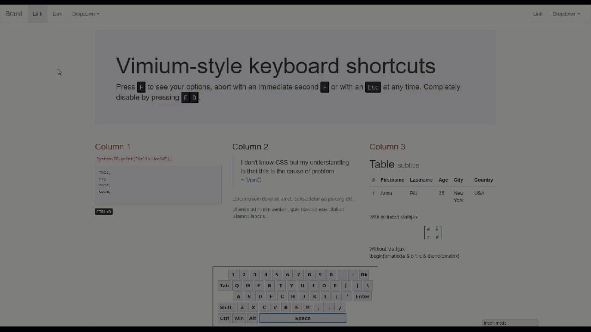

# Brotkeys.js

> **Capture and react to user-typed words. Make your website keyboard-friendly with minimal effort.**

Brotkeys builds upon [jaywcjaylove's hotkeys](https://github.com/jaywcjlove/hotkeys) and depends on [their release](https://github.com/jaywcjlove/hotkeys/blob/master/dist/hotkeys.common.min.js) to offer the additional functionality of reacting not only to a given key press, but also to words, by specifying a javascript function that shall be executed.

## Features

* listen for specific words
* set a character that has to preceed any input
* be informed on start and end of user input, or at every character
* automatically generate an "open link" action for every anchor tag or a specific css class

## Usage

### [Autogeneration - click me to jump ahead](#autogeneration) 

### [Quick Start Guide](https://eric.mink.li/publications/brotkeys_quickstart.html)

### Basic Example

Executes the given javascript function when the word is typed. There is no way to start a new word while typing the old word. So `hello` will show a popup saying "general kenobi!", but if you start typing `about` and then decide to switch to `hello`, there won't be any reaction to `abhello`.

```html
<script src="./libs/jaywcjlove_hotkeys/hotkeys.min.js"></script>
<script src="./libs/lucidbrot_brotkeys/brotkeys.js"></script>
<script type="text/javascript">
    // The HotkeyManager class is provided by Brotkeys.js
    var manager;
    var wordMap = new Map([
        ["hello", function(){alert("general kenobi!");}],
        ["about", function(){window.open("https://www.example.com/about", "_self");}],
        ["disable", function(){manager.disable();
                               console.log("No longer listening for words");}]
    ]);
    manager = new HotkeyManager(wordMap, new Map([]));
    manager.enable_f_mode(false); // explanation in next subsection
</script>
```

### F_Mode Example

Brotkeys.js was developed with the idea of [Vimium](https://chrome.google.com/webstore/detail/vimium/dbepggeogbaibhgnhhndojpepiihcmeb) in mind. In short: press F to see what to type in order to open a link without using the mouse. See below for an example of how vimium works (the yellow things) and how a simple website is able to offer the same functionality with Brotkeys.js.


In order for this to work, there's a special option that is set to enabled by default: `manager.enable_f_mode(true)` causes Brotkeys.js to only listen to words that are entered after they press `F`. You can change that to some other character using `manager.set_f_mode_character('g')` for example.

#### Interrupting Words

Here's what F_Mode is good for: Your user can abort typing one word and start typing another. For example  by pressing `F` instantly again after having pressed `F` for the first time. Or by pressing `Esc` anytime during F_Mode.

```html
<script src="./libs/jaywcjlove_hotkeys/hotkeys.min.js"></script>
<script src="./libs/lucidbrot_brotkeys/brotkeys.js"></script>
<script type="text/javascript">
	var manager;
// words of the form [f]abcdefg unless enable_f_mode is set to false
var wordMap = new Map([
	// default settings
	["f", function(){manager.abort_f_mode();}],
	["d", function(){console.log("user disabled shortcuts"); manager.disable();}],
	// my defined words
	["asd", function(){alert("you typed asd");}],
	["asdf", function(){alert("you typed asdf");}],
	["qwer", function(){alert("you typed qwer");}],
]);
// single characters that can interrupt at any time during the word-typing mode
var interruptMap = new Map([
	["escape", function(){manager.abort_f_mode();}],
]);
manager = new HotkeyManager(wordMap, interruptMap);
</script>
```

(Of course, `Esc` is not the smartest choice if your users are already using Vimium, because it leaves the insert mode of Vimium.)



### Get Notified

Register a listener function to be called whenever F_Mode is entered or left.

```javascript
// please notify me on entering and leaving fmode
var notifyFModeFunc = function(entering){
	if(entering){
		StyleSwapper.showKeys(true, "LB-SS-swap1"); //important: this class must be defined in an _external_ css file.
	} else {
		StyleSwapper.showKeys(false, "LB-SS-swap1");
	}
};
manager.setNotifyFModeFunction(notifyFModeFunc);
// To disable the notifyMe function:
// manager.setNotifyMeFunction(undefined);
```

Similarly, you can set a function to be called whenever the user is typing _anything_ while in F_Mode. If you have turned F_Mode off, replace this sentence with "... whenever the user is typing _anything_. period.".

```javascript
// please notify me on every keystroke instead of only at the end
var notifyFunc = function(current_word, remaining_words_possible){
var index_in_word = current_word.length;
console.log("---notify---\n["+index_in_word+"]Remaining words: "+remaining_words_possible+"\nCurrent word: "+current_word);
};
manager.setNotifyMeFunction(notifyFunc);
/*
Example result:

keys.html:331 ---notify---
[1]Remaining words: asd,asdf
Current word: a
keys.html:331 ---notify---
[2]Remaining words: asd,asdf
Current word: as
keys.html:331 ---notify---
[3]Remaining words: 
Current word: asf
f not found in available word options. Leaving f_mode.
keys.html:331 ---notify---
[1]Remaining words: qwer
Current word: q
keys.html:331 ---notify---
[2]Remaining words: qwer
Current word: qw
keys.html:331 ---notify---
[3]Remaining words: qwer
Current word: qwe
keys.html:331 ---notify---
[4]Remaining words: qwer
Current word: qwer
*/
// To disable the notifyMe function:
// manager.setNotifyMeFunction(undefined);

// To disable f_mode functionality (fmode means that you have to first press f - or whatever character you designed - before I start accepting words) :
// manager.enable_f_mode(false);
```

### Autogeneration

You already have a webpage, filled with hundreds of links. You want for every link some link hint that displays a word, and when the user types that word it shall open the link.
If you want much control, read the rest of this readme, set up your manager, and then call `manager.autogenerate(manager.GenerationEnum.tag_anchor, undefined, swap_class);`. If you want a **quick start**, do this:

```html
<script src="./libs/jaywcjlove_hotkeys/hotkeys.min.js"></script>
<script src="./libs/lucidbrot_brotkeys/brotkeys.js"></script>
<script type="text/javascript">
	brotkeys_autogenerate_manager_for_anchors();
</script>
```

Now you have exactly what I described above.

Of course, that does not sate your thirst for power, you want _exactly that, but for other things_. Here you go: simply give each of your HTML elements the same CSS class - I'll use `class="some other classes BHK"` and then use

```html
<script src="./libs/jaywcjlove_hotkeys/hotkeys.min.js"></script>
<script src="./libs/lucidbrot_brotkeys/brotkeys.js"></script>
<script type="text/javascript">
	brotkeys_autogenerate_manager_for_class_tag("BHK")
</script>
```

And if you want even more control, here's what's lacking.
In the way I just showed you, you do not have access to the HotkeyManager variable where you can change settings. If you want that, you could either use the implementation of the above-called functions as inspiration, or do it like I did in my sample page:

```js
var manager;
// words of the form [f]abcdefg unless enable_f_mode is set to false
// DONT INCLUDE AN UPPERCASE X, because that is used to immediately abort f mode here.
var wordMap = new Map([
	["secret", function(){window.open("https://eric.mink.li/src/php/ccount/click.php?id=sneric","_self");}],
]);
// single characters that can interrupt at any time during the word-typing mode
var interruptMap = new Map([
	["X", function(){manager.abort_f_mode();}],
	["D", function(){console.log("user disabled shortcuts"); manager.disable();}],
]);

manager = new HotkeyManager(wordMap, interruptMap);
manager.interrupt_caseInsensitivity = false;

manager.loadNeededJSCSSForStyleSwapping();
// please notify me on entering and leaving fmode simply by showing the link hints
// this is the simplest way to do this. for other options, see the examples in brotkeys.js#brotkeys_autogenerate_manager_for_anchors and brotkeys.js#brotkeys_autogenerate_manager_for_class_tag
var notifyFModeFunc = manager.genToggleKeysOnNotify();
manager.setNotifyFModeFunction(notifyFModeFunc);
manager.log_prefix = "[M] ";
manager.autogenerate(manager.GenerationEnum.tag_anchor);
```

In this sample, I first create `wordMap`, a mapping from words to actions. `"secret"` is something I added manually, and whenever somebody types that (while in fMode, since I did not deactivate fMode) it calls the javascript function in that map, which opens some other url.
The `interruptMap` contains things that can always happen, while in fMode, and interrupt the other actions.
I create the manager with those two arrays as start setup, tell it that I want case sensitive interrupts. The call to `loadNeededJSCSSForStyleSwapping();` is only neccessary when not using `manager.genToggleKeysOnNotify()` but still using my css class - so _it is not needed here_. But it will usually not hurt to call it anyways, since it instantly returns if it has been called before on the same manager. Generally speaking, you probably never need this, but if something doesn't look correctly (or at all), try calling this.
`genToggleKeysOnNotify` is a function that is tricky to explain, but in fact quite simple. `setNotifyFModeFunction` takes as argument any function that reacts to toggling of the fMode. `genToggleKeysOnNotify` generates such a function for you so you don't have to worry about this unless you want to use your own function instead. In that case, read the start of this readme instead, I think I have another example there.
The log prefix is just that, a prefix before any log messages.
And finally, the call to `autogenerate`.

`autogenerate` takes up to three arguments. The first is mandatory: Either `manager.GenerationEnum.tag_anchor` or `manager.GenerationEnum.class_tag`. This states what you want to autogenerate.
If you want to generate for anchors, you can pass `undefined` as the second argument. Otherwise the second argument is used as your class name that will be operated on.
The third argument is replaced with `manager.SWAP_CLASS_NAME_DEFAULT` if you're passing `undefined`. It serves as the class name used for the link hint buttons that appear and disappear. Make sure it's the same as in `genToggleKeysOnNotify` if you have passed something there - and undefined if not.

### Autogenerate Within ID

The same thing as `autogenerate`, but only for all elements within a given container instead of for all elements within the document.

```javascript
autogenerateWithinId(containerId, generationTarget, /*optional*/ css_class_name, /*optional*/ arbitraty_swap_class_name)
```

`containerId` - String, ID of the container element
For the other arguments, see in the section on [autogenerate](#autogeneration), which is right above this one.


### Multiple HotkeyManagers

I don't know why you would do this, but that works as well. Just be aware that using `hotkeys.unbind('*')` would break the behaviour of the Managers (but that's always the case, not just when using multiple managers).  

```javascript
// a manager
var man1 = new HotkeyManager(new Map([["free", function(){console.log("man1: you typed free");}]]), new Map([]));
// another manager
var man2 = new HotkeyManager(new Map([["tree", function(){console.log("man2: you typed tree");}]]), new Map([]));
```

To distinguish between them for debugging, it can help to set a prefix the internal log messages:

```javascript
man2.log_prefix = "[M2]";
man1.log_prefix = "[M1]";
```

### Case Sensitivity

The `HotkeyManager` has three settings regarding case sensitivity, which are all by default set to true (insensitive):

```javascript
// config for key case insensitivity
		this.fmode_caseInsensitivity = true;
		this.interrupt_caseInsensitivity = true;
		this.word_caseInsensitivity = true;
```

You should be able to set these values using direct qualified access.

The first line is whether `F` and `f` both trigger F_Mode.
The second line is whether characters in interruptMap are case insensitive.
The third line is whether capitalization in words matters. True if it does not matter.

See also further below about an obscure setting called `ignore_ShiftAndCapslock_inWordMode`.

### Modify The Link Hints Style

Simply provide your own css class and set `manager.LINKHINT_STYLE_CLASS` to it.
The currently used one:

```css
kbd.eric-reverse {
	background-color: #fff;
	color: #333;
	border-style: dashed;
}
```

### OverlayMode

The Link Hints can either show up _within_ the page content (text), or overlayed. By default, brotkeys.js uses overlayMode because that way, the content is not moved when the link hints appear. If you prefer the Link Hints to be directly embedded instead of using absolute positioning and a container element, you can do `manager.setOverlayMode(false)` before generating the link hints.

## Using Defer

It seems like a cool feature, `defer`. But it makes it impossible for Brotkeys to figure out where it is stored. There are several ways to solve this problem, but the simplest way is not to use `defer`.
The second simplest way is to tell Brotkey where it is stored:

```html
<!-- main.html -->
<script src="./libs/jaywcjlove_hotkeys/hotkeys.min.js" defer></script>
<script src="./libs/lucidbrot_brotkeys/brotkeys.js" defer></script>
<script src="./keyjs/main.js" defer></script>
```

```js
// main.js
// since we used defer in main.html for brotkeys, we have to tell brotkeys where it lives. Absolute, or relative to the HTML file where this js file is included in.
_brotkeysjs__src__path = './libs/lucidbrot_brotkeys/brotkeys.js';
```

This is only relevant if you are using [autogenerate](#autogeneration) or anything else that uses [loadNeededJSCSSForStyleSwapping](#loadneededjscssforstyleswapping).

## Implementation Details

If you want to know what's going on, without reading the actual code.  

### ignore_ShiftAndCapslock_inWordMode

There is also the option `this.ignore_ShiftAndCapslock_inWordMode = true`. If it is enabled, Brotkeys.js ignores entered shift and capslock keys themselves while within a word. Otherwise, `eXample` and `example` would not be the same word, even with case insensitivity on - because it would be `eshiftXample` internally. And I don't think you could capture that without writing your own code instead of using Brotkeys.js. But you're welcome to try what happens if you set this to false.  
This is where that setting is used internally: when we know that there was no word matching the latest `key`:

```javascript
if(counter == 0){
			if(this.ignore_ShiftAndCapslock_inWordMode && (key=="shift" || key=="capslock")){
				// ignore shift or capslock key if we're in word mode and it was not specified in the remaining possible words
				this.log_verbose("ignoring "+key+" because there are no possible matches containing it and this.ignore_ShiftAndCapslock_inWordMode equals true");
				this.current_link_word = this.current_link_word.slice(0, -(key.length)); // remove last character again
				return;
			}
			this.log_verbose(key+" not found in available word options. Leaving f_mode.");
			this.leave_f_mode();
			return;
		}
```

### Construction

`constructor(wordMap, interruptMap)`

wordMap maps user-typed words to javascript functions. InterruptMap maps single characters that are always interrupting word entering to execute their own javascript function to those functions.

### current_link_word

Do not modify this, it's used internally. However, reading is fine.
It tells you what characters from the current word the user has already entered.

### mode

Again, if you overwrite this, maybe you break something. But you can read this and get one of the values as specified here:

```javascript
this.ModeEnum = Object.freeze({"f_mode":1, "pre_f_mode":2, "all_disabled":3});
```

### log

Use `log_verbose`, `log_error`, `log_happy` as you please. No side effects apart from formatted writing to `console.log()`.

### enter_f_mode, leave_f_mode, abort_f_mode

Do what they say. Abort simply logs and then calls leave. These are used internally but should be ok to use from outside.

### enable_f_mode

Overwrites `leave_f_mode`, so if for some reason, you're overwriting that as well, consider this.

### disable

Does not unregister the listener to hotkeys.js - it simply does not act on the events until activated again using `enable_f_mode` with either true or false as parameter. (True if you want F_Mode).  

If you're disabling the manager with a user-typed-word-reaction, you want to also `manager.leave_f_mode()`, else the link hints remain visible.

### hotkeys_init

There's no harm in calling this, I think. But there's also no reason to. It's called from the constructor.

### loadNeededJSCSSForStyleSwapping

This loads the css needed for toggling the style of the link hints when hiding them.

### Anything Else

Don't touch unless you've read the code.

## Licencing

```javascript
log_happy(text){
		/*
			https://stackoverflow.com/a/21457293/2550406
			(c) bartburkhardt cc-by-sa 3.0
		*/
		[code skipped]
	}
```

`log_happy` was originally provided under CC-BY-SA. However, if this is of concern to you, just remove the function and replace it with a simple `console.log()`. Also, I don't think they care - after all, everybody steals from stackoverflow.

My own code is provided as-is without guarantees, under MIT Licence as provided in the LICENCE file.

I'd be happy to hear about it when you use my code though :)
eric@mink.li

## Note on the Beauty of the Code

It's probably ugly. I've tried a little, but not too hard, and javascript does not offer the options I'm used to. This is not a "sorry", it's just a "I knew that it was ugly when I wrote it, I'm not that incompetent".
